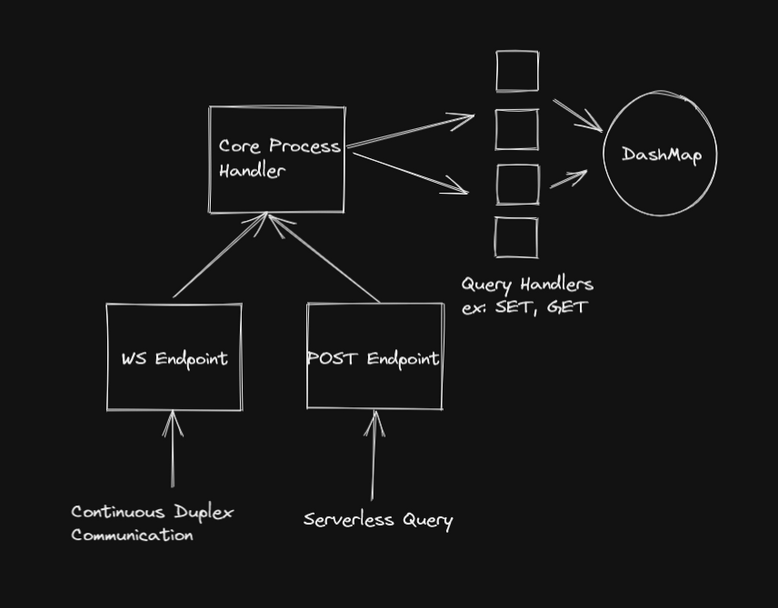

# About MemFast
MemFast is a super fast and simple to use Key-Value store built in Rust Lang and Axum.rs.

### Fast and Memory Safety
All because of Rust's Memory Safety and Axum's Speed.

### Serverless
Traditional Key-Value stores like Redis are not Serverless by default. But MemFast includes a simple POST endpoint that can be used to send queries from a Serverless Context.

### Driverless
MemFast exposes two simple services: WS and POST. Use WS for continuous queries and POST for one-off queries.

### Lazy Persistence
MemFast can dump all the Key-Value pairs into a CSV file on demand.

### Key Synchronization
MemFast has the ability to synchronize keys between multiple MemFast instances.

## Basic Architecture

